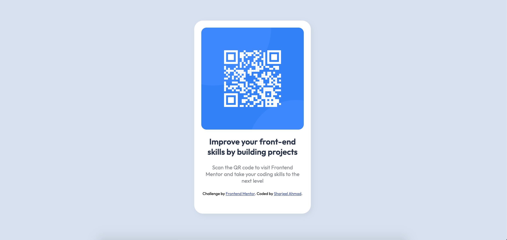
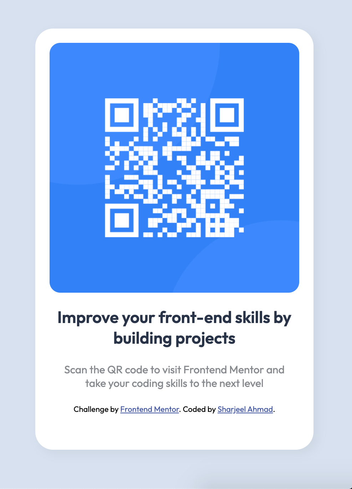

# Frontend Mentor - QR code component solution

This is a solution to the [QR code component challenge on Frontend Mentor](https://www.frontendmentor.io/challenges/qr-code-component-iux_sIO_H). Frontend Mentor challenges help you improve your coding skills by building realistic projects.

## Table of contents

- [Overview](#overview)
  - [Screenshot](#screenshot)
  - [Links](#links)
- [My process](#my-process)
  - [Built with](#built-with)
  - [What I learned](#what-i-learned)
  - [Continued development](#continued-development)
- [Author](#author)

## Overview

### Screenshot

### Links

- Live Site URL: (https://subtle-frangollo-170123.netlify.app/)

## My Process

### Built with

- HTML
- CSS custom properties
- Mobile-first workflow

### What I learned

I replicated the design as close as possible to the concept design. This gave me an idea of what actual frontend projects look like. I had to analyze the requirements, and try to achieve the required result that is a near replicate of the original design. Once the development was completed, I learned to how properly use Git on my code and comitted it to my GitHub repo. Afterwards, I uploaded it on netlify for wider use. Now I'm just about to commit this revised README file as well.

### Continued development

I will continue to enhance my stying skills, use Semantic HTML5 Markup and will try to use JS to add dynamic features and functionality.

## Author

- Frontend Mentor - [@iamsharjeelahmad](https://www.frontendmentor.io/profile/iamsharjeelahmad)
- GitHub - [@iamsharjeelahmad] (https://github.com/iamsharjeelahmad/)
- LinkedIn - [@thisissharjeel](https://www.linkedin.com/in/thisissharjeel/)
